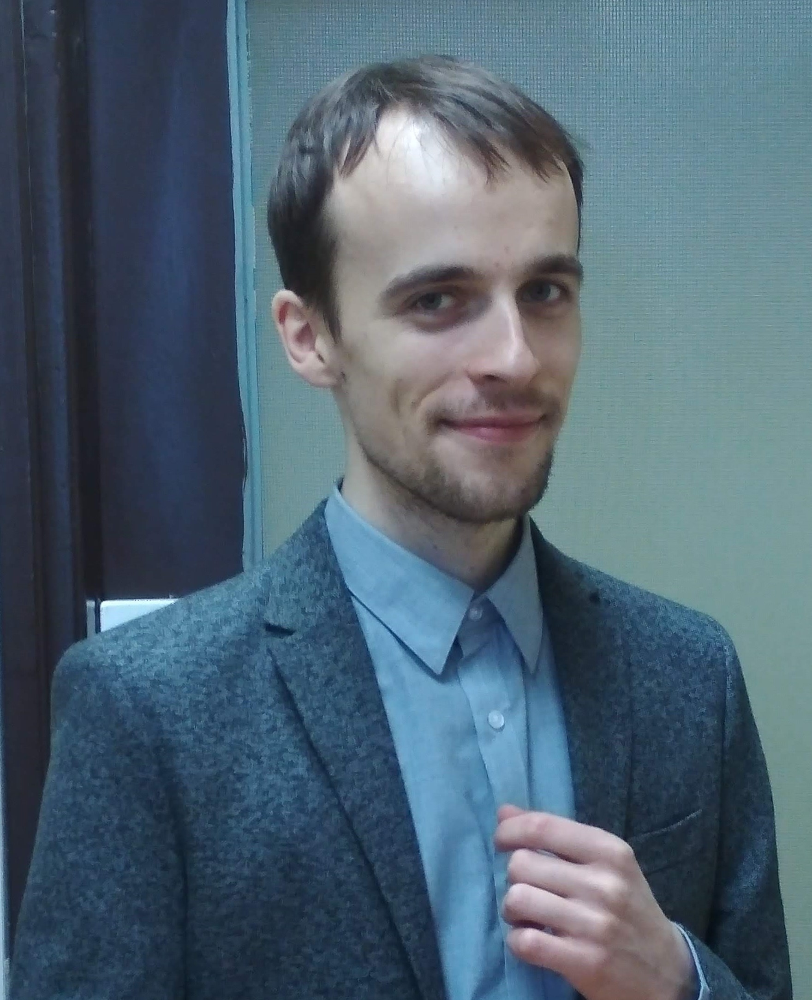

Hi! My name is Konrad Patucha. I am a theoretical physics PhD specializing in emergent phenomena in complex condensed matter systems. I am also interested in machine learning.

Currently I am working as a quantitative analyst at [Allianz Lebensversicherungs-AG](https://www.allianz.de/). Previously I was an assitant professor at [ILTSR PAS](https://www.intibs.pl/).

In my free time I experiment in the kitchen and play video games and board games.

