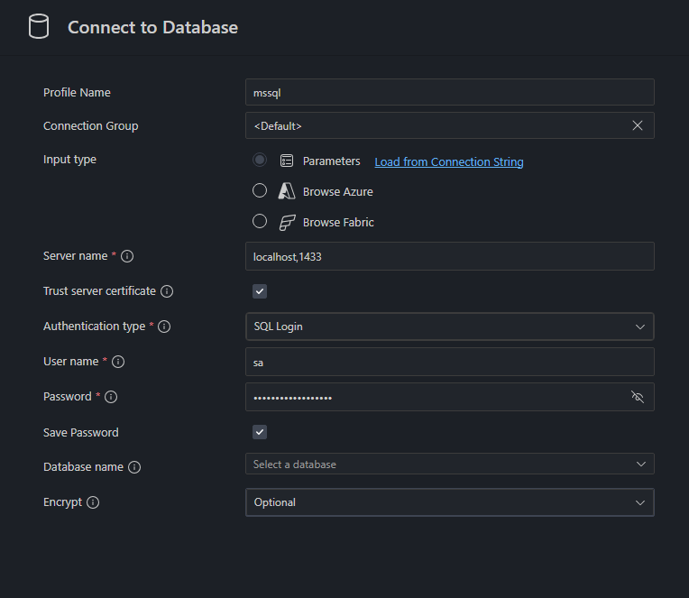
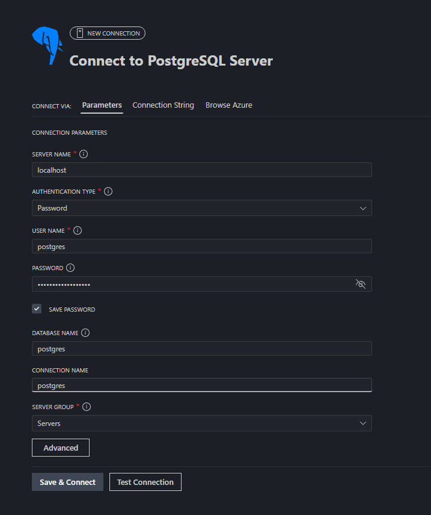
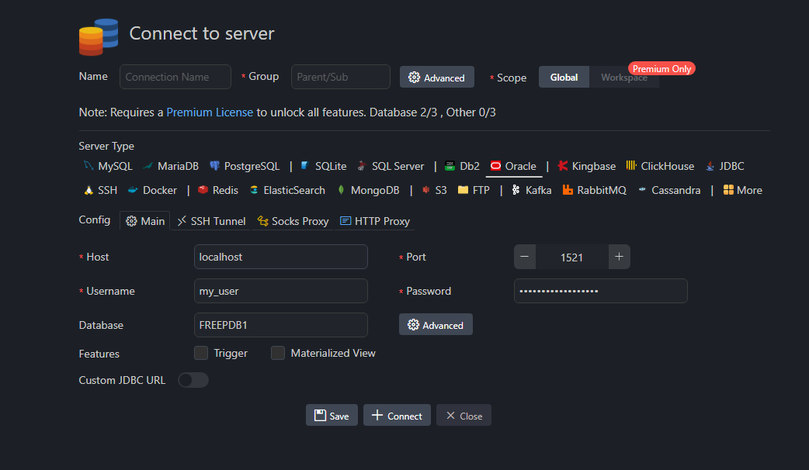
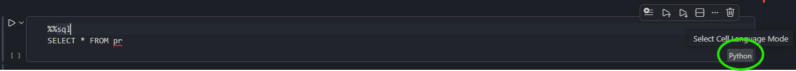
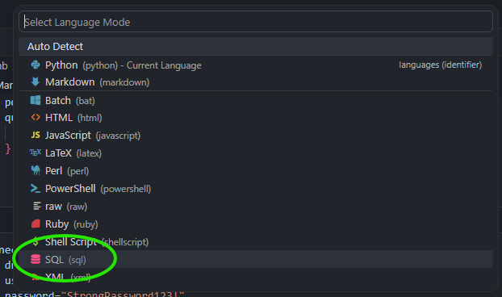
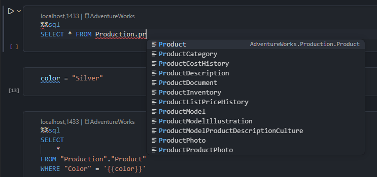

# Motivation

As a Data Scientist I often work with SQL and Python. I wanted to find a way to blend work with both of these environments seamlessly. I wanted to avoid switching between tools, because I often need to query a database and transfer the result into Python for further processing. Here I present the setup I came up with for VS Code.

# TL;DR
1. Connect to the database using one of the VS Code extensions
    - [SQL Server (mssql) extension](https://marketplace.visualstudio.com/items?itemName=ms-mssql.mssql)
    - [PostgreSQL extension](https://marketplace.visualstudio.com/items?itemName=ms-ossdata.vscode-pgsql) by Microsoft
    - [PostgreSQL extension](https://marketplace.visualstudio.com/items?itemName=cweijan.vscode-postgresql-client2) by Database Client (supports other databases like Oracle, DuckDB etc.)
2. Install [JupySQL](https://jupysql.readthedocs.io/en/latest/quick-start.html)

    ```bash
    pip install jupysql
    ```
3. Create [SQLAlchemy engine](https://docs.sqlalchemy.org/en/20/core/connections.html#module-sqlalchemy.engine) and assign it to `engine` variable
4. Load JupySQL magics and connect using `engine`

    ```python
    %load_ext sql
    %sql engine --alias my_db
    ```
5. In the cell you want to write SQL, change cell language to SQL (`Ctrl + K, M` by default)
6. Make sure the cell is connected to the database (active connection is visible at the top of the SQL cell)

7. Put `%%sql` magic at the top of the SQL cell
8. Write your SQL and enjoy SQL IntelliSense (context aware autocomplete), SQL formatting and work with [Pandas DataFrames](https://jupysql.readthedocs.io/en/latest/integrations/pandas.html)
9. ???
10. Profit!

# Requirements
::: {.panel-tabset group="db_type"}
## SQL Server
- VS Code (I used version 1.122.1)
- [Jupyter extension](https://marketplace.visualstudio.com/items?itemName=ms-toolsai.jupyter) (and other dependencies like Python extensions etc.)
- [SQL Server (mssql) extension](https://marketplace.visualstudio.com/items?itemName=ms-mssql.mssql) [^1]
- [ODBC drivers for SQL Server](https://learn.microsoft.com/en-us/sql/connect/odbc/download-odbc-driver-for-sql-server?view=sql-server-ver17) - often preinstalled in the system
- Python packages

    ```bash
    pip install jupysql pandas ipykernel pyodbc
    ```

[^1]: Recently [SQL notebooks](https://learn.microsoft.com/en-us/sql/tools/visual-studio-code-extensions/mssql/mssql-sql-notebooks?view=sql-server-ver17) were added to the SQL Server (mssql) extension. They are for SQL only - you cannot work with Python AND SQL in the same notebook. Be careful not to change kernel to MSSQL - it overrides notebook metadata. When you try to go back to Python kernel ALL code cells will have language changed to SQL without easy option to go back - you need to open the notebook with text editor and delete `"metadata": {"vscode": {"languageId": "sql"}}` from each cell.

## PostgreSQL
- VS Code (I used version 1.122.1)
- [Jupyter extension](https://marketplace.visualstudio.com/items?itemName=ms-toolsai.jupyter) (and other dependencies like Python extensions etc.)
- [PostgreSQL extension](https://marketplace.visualstudio.com/items?itemName=ms-ossdata.vscode-pgsql) - this one is by Microsoft. [PostgreSQL extension](https://marketplace.visualstudio.com/items?itemName=cweijan.vscode-postgresql-client2) by Database Client also works.
- Python packages

    ```bash
    pip install jupysql pandas ipykernel "psycopg[binary]"
    ```

## Oracle and others
- VS Code (I used version 1.122.1)
- [Jupyter extension](https://marketplace.visualstudio.com/items?itemName=ms-toolsai.jupyter) (and other dependencies like Python extensions etc.)
- [PostgreSQL extension](https://marketplace.visualstudio.com/items?itemName=cweijan.vscode-postgresql-client2) by Database Client (only 3 configured connections in free tier, but supports multiple database types)[^2]
- Python packages

    ```bash
    pip install jupysql pandas ipykernel
    pip install oracledb # or other relevant database driver
    ```

[^2]: Although there is official [Oracle extension](https://marketplace.visualstudio.com/items?itemName=Oracle.sql-developer) it doesn't integrate with Jupyter notebooks nicely since it introduces new language PL/SQL which is not available for Jupyter notebook cells.
:::

# Connect to the database
## VS Code extension
Establish connection to the database in your VS Code extension

::: {.panel-tabset group="db_type"}
## SQL Server
To test SQL Server I used [this](https://hub.docker.com/layers/chriseaton/adventureworks/latest/images/sha256-aef97e8fb775dc6d19674a97979d17b7ae46ac634a49246dfd85f1b101bfae5c) docker image by Chris Eaton with AdventureWorks database prepopulated.


## PostgreSQL
To test PostgreSQL I used [this](https://hub.docker.com/layers/chriseaton/adventureworks/postgres/images/sha256-3d396f7e340138edf27f0ec6cd6b90e50da314a73d4cc7d98d7bf576ecac4faf) docker image by Chris Eaton with AdventureWorks database prepopulated.


## Oracle and others
To test Oracle I used [this](https://hub.docker.com/layers/gvenzl/oracle-free/latest/images/sha256-d3760c92e53ce623e3f66e365209044a611ad7053230cfbd46f6c2958ee948a8) docker image by Gerald Venzl.


:::

## SQLAlchemy engine
Create [SQLAlchemy engine](https://docs.sqlalchemy.org/en/20/core/connections.html#module-sqlalchemy.engine)

::: {.panel-tabset group="db_type"}
## SQL Server
```python
import getpass
import sqlalchemy as sa
import pyodbc

driver = [driver for driver in pyodbc.drivers() if "ODBC" in driver][0] # take available ODBC driver

connection_url = sa.engine.URL.create(
    drivername="mssql+pyodbc", # dialect+driver
    username="sa",
    password=getpass.getpass(), # you can write password here in plain text or pass environment variable
    host="localhost",
    port="1433",
    database="AdventureWorks",
    query={ # different key: value pairs for each type of database
        "driver": driver,
        "Encrypted": "yes",
        "TrustServerCertificate": "yes",
    },
)

engine = sa.create_engine(connection_url)
```

## PostgreSQL
```python
import getpass
import sqlalchemy as sa

connection_url = sa.engine.URL.create(
    drivername="postgresql+psycopg", # dialect+driver
    username="postgres",
    password=getpass.getpass(), # you can write password here in plain text or pass environment variable
    host="localhost",
    port="5432",
    database="postgres",
)

engine = sa.create_engine(connection_url)
```

## Oracle and others
```python
import getpass
import sqlalchemy as sa

connection_url = sa.engine.URL.create(
    drivername="oracle+oracledb", # dialect+driver
    username="my_user",
    password=getpass.getpass(), # you can write password here in plain text or pass environment variable
    host="localhost",
    port="1521",
    query={ # different key: value pairs for each type of database
        "service_name": "FREEPDB1"
    }
)

engine = sa.create_engine(connection_url)
```
:::

## JupySQL
Load [JupySQL](https://jupysql.readthedocs.io/en/latest/quick-start.html) magics and pass `engine` to establish connection (best use `--alias` here for future reference)

```python
%load_ext sql
%sql engine --alias my_db
```

## SQL cell
Change language of the cell to SQL either by:

- clicking in right bottom corner of the cell
    
- using command palette (by default `Ctrl+Shift+P`) and choosing `Notebook: Change Cell Language`
- using shortcut `Ctrl+K, M` (by default)

\


Make sure that the cell is connected to the database by looking at the little text at the top left of the cell (you might need to click it select the connection and database)

::: {.panel-tabset group="db_type"}
## SQL Server
\


## PostgreSQL
\


## Oracle and others
\

:::

# Write SQL in the cell
Put `%%sql` magic at the top of the cell. You can now write SQL queries in the SQL cell and enjoy IntelliSense (context aware autocomplete) for SQL syntax and database objects as well as SQL formatting[^3].

[^3]: Depending on your formatting options it might not like `%%sql` magic as it is not part of standard SQL syntax - you can simply put it at the top of the cell just before execution.

I must admit the setup is kind of fragile. In case IntelliSense for database objects doesn't work try one or all of these:

- using command palette (`Ctrl+Shift+P`) select `MS SQL: Refresh IntelliSense Cache` (or equivalent in other extension)
- delete cell and create new one (change it's language to SQL and connect it to database)
- restart VS Code
- (this one is weird) type your first SQL queries slowly, once it gets going you can type faster (maybe it has something to do with the fact that SQL IntelliSense in VS Code is kinda slow?)

\


# Work with pandas
In order to pass the result of the query to Pandas DataFrame there is a two step process

1. Assign result to a variable e.g. `sql_result` modyfying the `%%sql` magic
    
    ```python
    %%sql sql_result <<
    SELECT
    *
    FROM Production.Product
    ```
2. In next Python cell extract it to DataFrame

    ```python
    df_result = sql_result.DataFrame()
    ```

Alternatively, you can setup Pandas output globally (this allows to skip second step):

```python
%config SqlMagic.autopanda = True
```

To save an existing DataFrame `df` to database you can use flag `--persist` or `--persist-replace` (table will have the same name as the DataFrame variable, `schema` is simply schema in the database)

```python
%sql --persist schema.df
%sql --persist-replace schema.df 
```

# Close connection
To close connection use `--close` flag with connection alias

```python
%sql --close my_db
```

# Other features
There are a lot of other features in JupySQL like

- parametric queries using Jinja
- working with multiple connections
- query `.csv` and Excel files
- plotting results of the queries

and much more. Everything is cleanly explained in the [JupySQL documentation](https://jupysql.readthedocs.io/en/latest/quick-start.html)
